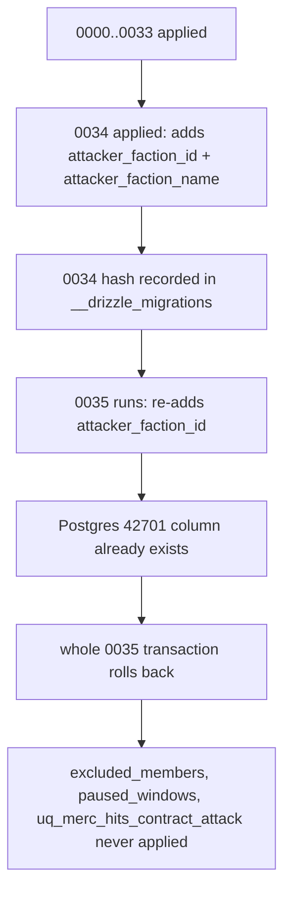

# Drizzle Migration Chain Repair — 0034/0035

## Root Cause

`drizzle/0034_merc_hit_attacker_faction.sql` was hand-written and registered in
`_journal.json`, but **no `0034_snapshot.json` was ever produced**. `drizzle-kit generate`
therefore based itself on `0033_snapshot.json` and emitted `0035_great_venus.sql`, which
re-issues the same two `ALTER TABLE ... ADD COLUMN` statements 0034 already applied.

Proof the chain is broken — `meta/0035_snapshot.json`:

```json
{ "id": "18526cc2-…", "prevId": "73b2c320-…" }
```

and `meta/0033_snapshot.json`:

```json
{ "id": "73b2c320-…", "prevId": "bae2860c-…" }
```

`0035.prevId === 0033.id`, so 0035 was generated straight off 0033. 0034 is invisible to the
generator, hence the duplicate DDL.

Two aggravating factors:

1. **Filename collision** — both `0035_great_venus.sql` and `0035_merc_excluded_members.sql`
   share the `0035` prefix.
2. **Orphan file** — `0035_merc_excluded_members.sql` is **not** in `_journal.json`, so the
   migrator never executes it. It is dead weight that misleads readers.

## Why `42701` fires



Because 0035 aborts inside one transaction, **nothing** from 0035 landed. The DB is left
exactly at the post-0034 state.

## CRITICAL — do not bare-reset the migration table

[`migrate.ts`](../packages/database/src/scripts/migrate.ts:36) contains a baselining branch:

- If `public.api_keys` exists **and** `drizzle.__drizzle_migrations` is empty,
- it inserts **only** the `0000` hash, then calls `migrate()`.

Running `TRUNCATE drizzle.__drizzle_migrations` on an already-migrated database would mark
0000 applied and then **replay 0001 through 0034 against a schema that already has every one of
those objects** — recreating the exact failure mode, at far greater scale.

The safe local reset is a schema-level drop, not a table-level truncate.

## Target end state

A single regenerated migration numbered `0034` containing:

```sql
ALTER TABLE "merc_contract_hits" ADD COLUMN IF NOT EXISTS "attacker_faction_id" integer;
ALTER TABLE "merc_contract_hits" ADD COLUMN IF NOT EXISTS "attacker_faction_name" text;
ALTER TABLE "merc_contract_hits" DROP CONSTRAINT IF EXISTS "merc_contract_hits_attack_id_unique";
ALTER TABLE "merc_contracts" ADD COLUMN IF NOT EXISTS "excluded_members" jsonb DEFAULT '[]'::jsonb NOT NULL;
ALTER TABLE "merc_contracts" ADD COLUMN IF NOT EXISTS "paused_windows" jsonb DEFAULT '[]'::jsonb NOT NULL;
CREATE UNIQUE INDEX IF NOT EXISTS "uq_merc_hits_contract_attack"
  ON "merc_contract_hits" USING btree ("contract_id","attack_id");
```

`IF NOT EXISTS` / `IF EXISTS` are required: prod already applied the old hand-written 0034, so
this file must be safe to run against a DB where the columns exist.

## Resolution (completed)

Applied locally. `0034_merc_hit_attacker_faction.sql`, `0035_great_venus.sql`,
`0035_merc_excluded_members.sql`, and `meta/0035_snapshot.json` were deleted; the journal was
trimmed back to idx 33 and `bun db:generate` emitted a single
`0034_rare_queen_noir.sql` plus `0034_snapshot.json` whose `prevId` = `0033_snapshot.json`'s
`id`. Its DDL was made idempotent.

No schema drop was required — idempotency removed the need to assume a virgin database, so
local data was left untouched.

Verified against the live database:

| Check | Result |
| --- | --- |
| `attacker_faction_id` / `attacker_faction_name` | present, nullable, no default |
| `excluded_members` / `paused_windows` | present, `NOT NULL`, default `'[]'::jsonb` |
| `uq_merc_hits_contract_attack` | present on `(contract_id, attack_id)` |
| `merc_contract_hits_attack_id_unique` | correctly dropped |
| `drizzle.__drizzle_migrations` | 36 rows, `max(created_at) = 1790975789045` |
| Re-running `bun db:migrate` | succeeds (idempotent) |
| `bun typecheck` | exit 0 |
| `bun test` | 473 pass / 0 fail |

Metadata audit: 35 journal entries and 35 SQL files, zero orphans, zero duplicate `idx`
prefixes, contiguous `idx` 0..34, journal order matching filename order.

Note: `42701` now appears as a **NOTICE** ("skipping") during migration rather than an error.
That is `IF NOT EXISTS` doing its job.

## Latent (pre-existing, benign)

`0011`, `0015`, and `0016` are also hand-written migrations with no matching snapshot. They are
harmless because each was already applied and is fully superseded by later snapshots. `0034` was
uniquely damaging because a fresh `generate` ran immediately after it.

## Deferred to a follow-up change

- **Prod reconciliation** — prod still has the old hand-written `0034` applied and the old
  journal. The regenerated migration is idempotent, so it applies cleanly, but prod's
  `drizzle.__drizzle_migrations` / `_journal.json` position must be reconciled with this repo
  before the next deploy. Do this alongside `scripts/merc-prod-recovery.sql`.
- **Recurrence guard** — a check that every `drizzle/*.sql` appears in `_journal.json` and that
  no two files share an `idx` prefix would have caught both the orphan file and the duplicate
  `0035` prefix immediately.
- **Hand-written migration policy** — prefer `bun db:generate` plus a hand-edit of the generated
  file, so the snapshot is always produced.