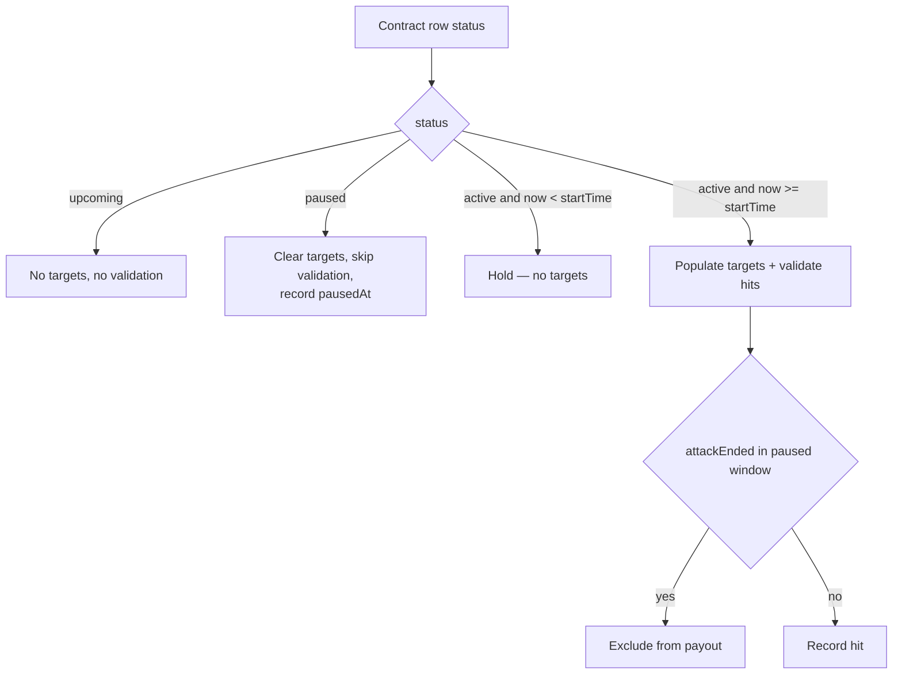

# Merc Contract System — Prod Incident Remediation Plan

> **Status: implemented.** All workstreams A–D and F1–F3 are complete.
> `tsc --noEmit` passes workspace-wide (root + dashboard) and the suite is
> **473 pass / 0 fail**. The prod recovery SQL is in
> [`scripts/merc-prod-recovery.sql`](../scripts/merc-prod-recovery.sql) and must
> be run manually — see section E.

## Root cause analysis

### 1. CRITICAL — file does not compile (orphaned catch block)

[`runMercAttackValidationCycle()`](services/scheduler/src/workers/merc/merc-attack-validator-worker.ts:287) has a stray
`catch` block at lines 605–617 that sits **after** the function's closing brace at line 604. This is leftover from
the unfinished agent. The file is syntactically invalid, so the attack validator worker cannot have been running
the current logic in prod.

```
   604		}
   605			} catch (err) {      <-- orphan: no matching try
   606	...
   617		}
   618	}
```

### 2. Cross-contract log interference — global `unique()` on attack_id

[`mercContractHits.attackId`](packages/database/src/schema/merc.ts:104) is declared `.unique()` **globally**, not
per contract. Meanwhile [`isAttackProcessed()`](services/scheduler/src/workers/merc/merc-attack-validator-worker.ts:501)
is queried per `(attackId, contractId)`.

Consequence: when contract A and contract B overlap (or A was never transitioned to `completed`), an attack
credited to A cannot be inserted for B — the insert raises a unique violation and is swallowed by the outer
`catch`. This is why the new contract showed no logs while the previous contract kept logging.

Fix: drop the global unique, replace with a composite unique on `(contractId, attackId)`, and make the dedup
check consistent.

### 3. Progress watermark advances past rejected attacks

In the pagination loop, [`highestAttackIdSeen`](services/scheduler/src/workers/merc/merc-attack-validator-worker.ts:405)
is updated **before** the stop-point and timeframe checks. The watermark is therefore persisted from a page that
was largely discarded, so a resumed run starts too late and never back-fills the gap.

### 4. `startMinutesBeforeWar` shifts `startTime`, producing pre-war target population

[`MercContractsPage.tsx`](web/dashboard/src/pages/MercContractsPage.tsx:623) computes
`startTime = warStart - startMinutesBeforeWar * 60000`. The worker correctly gates on
`nowMs >= startMs`, so targets appeared 5 min early because `startTime` itself was 5 min early.
Per your decision, `startMinutesBeforeWar` must **no longer** shift `startTime`.

### 5. `paused` is half-implemented

[`merc-contract-worker.ts`](services/scheduler/src/workers/merc/merc-contract-worker.ts:626) already selects
`paused` and calls `cleanContractTargets()`, and [`MercContractStatus`](packages/database/src/lib/guilds.ts:756)
already includes `"paused"`. Missing: the API status literal, the UI type/action, and validator-side handling.

---

## Target state



---

## Workstreams

### A. Restore compilation + log correctness (scheduler / database)

- [ ] A1. Remove orphaned `catch` block at lines 605–617 of
  [`merc-attack-validator-worker.ts`](services/scheduler/src/workers/merc/merc-attack-validator-worker.ts).
- [ ] A2. Migration: drop unique constraint on `merc_contract_hits.attack_id`; add composite unique
  `(contract_id, attack_id)`.
- [ ] A3. Align [`isAttackProcessed()`](packages/database/src/lib/guilds.ts) with the composite key so the
  dedup check matches the new constraint.
- [ ] A4. Move the `highestAttackIdSeen` watermark update to *after* timeframe/contract-start filtering so
  rejected pages do not advance persisted progress.
- [ ] A5. Add `pausedAt`/`pausedWindows` jsonb column to `mercContracts`; record pause windows on status
  transitions and filter out attacks whose `ended` timestamp falls inside them.
- [ ] A6. Handle `paused` in the validator's contract query (currently only
  `["active","upcoming"]`) — skip validation entirely while paused.
- [ ] A7. Guard `startImmediately` contracts so `startTime` is never back-dated before now.

### B. Contract timing semantics (scheduler / api / web)

- [ ] B1. Remove `startMinutesBeforeWar` from `startTime` computation in
  [`MercContractsPage.tsx`](web/dashboard/src/pages/MercContractsPage.tsx:623) — set `startTime = warStart`.
- [ ] B2. Apply the same change to
  [`ClientContractCreatePage.tsx`](web/dashboard/src/pages/ClientContractCreatePage.tsx:274).
- [ ] B3. Retain `startMinutesBeforeWar` purely as metadata/display for the "Pre-War" terms-change banner.
- [ ] B4. Normalise existing rows: `startTime = warStart` where `start_minutes_before_war IS NOT NULL`
  (delivered as SQL in section E).

### C. Stricken hit rendering (bot)

- [ ] C1. Add `EMBED_COLORS.STRICKEN` and a red block-character banner helper in
  [`embeds.ts`](services/bot/src/lib/embeds.ts).
- [ ] C2. Hit log embed ([`merc-alert-distributor.ts`](services/bot/src/lib/merc-alert-distributor.ts:676)) —
  force full DANGER color, red banner, hex-red title.
- [ ] C3. Target alert embeds at lines 468 and 562 — same treatment for `isStrickenEligible`.

### D. Pause + edit in UI/API

- [ ] D1. Add `"paused"` to the `status` union in the PUT validator body
  ([`guilds.ts`](services/api/src/routes/v2/guilds.ts:2080)).
- [ ] D2. Relax the `hasStarted` edit guard so active contracts accept `excludedMembers` and terms changes.
- [ ] D3. Persist pause windows in [`updateMercContract()`](packages/database/src/lib/guilds.ts) on
  `active -> paused` / `paused -> active`.
- [ ] D4. Emit `notifyBotAction` to clear target embeds on pause and refresh the announcement embed on
  unpause.
- [ ] D5. [`MercContractsPage.tsx`](web/dashboard/src/pages/MercContractsPage.tsx) — add `paused` to the
  status type, a Pause/Resume `DropdownMenuItem` per active contract, and a paused `Badge`.
- [ ] D6. Extend the edit dialog so exclusion targets are editable on active contracts.

> shadcn notes: use `DropdownMenu` + `DropdownMenuGroup`/`DropdownMenuItem` for the row actions,
> `AlertDialog` for destructive cancel, `Badge variant="destructive"` for paused, `sonner` `toast()` for
> feedback, and `FieldGroup`/`Field` for the edit form layout.

### E. Prod recovery runbook

Delivered as a TypeScript script: [`scripts/merc-prod-recovery.ts`](../scripts/merc-prod-recovery.ts).
It uses the application's own `sqlClient` connection, so it runs the same way as every
other script — **no `psql` and no container juggling required** (postgres runs in a
separate container from the systemd-managed services).

Run it after deploying:

```bash
ssh root@dejis-cloud
cd /opt/sentinel-v2

# Preview — read-only, writes nothing (default)
bun run merc:recover

# Apply the repairs
bun run merc:recover --apply
```

Steps in order: diagnose → backup → re-anchor `start_time` to `war_start` →
reset validator watermarks → close stale pause windows → verify.

Schema changes are **not** part of this script — they are Drizzle migrations that run
during deploy. This script only repairs rows left broken by the incident.

### F. Verification

- [ ] F1. `bunx tsc --noEmit` across workspace — confirm compilation restored.
- [ ] F2. `bun test` — extend
  [`merc-attack-validator.test.ts`](services/scheduler/tests/merc-worker.test.ts) and
  [`merc-contracts.test.ts`](services/api/tests/merc-contracts.test.ts).
- [ ] F3. New tests: targets not populated before `startTime`; paused contract yields no validation;
  hits inside a paused window excluded; same attack recordable under two contracts.
- [ ] F4. Manual prod verification after deploy: confirm targets appear at war start, `#merc-log` populates
  for the live contract, stricken embeds render red.

---

## Risk notes

- Changing `startTime` on active contracts is a live-data mutation — take a `merc_contracts` backup first.
- Deleting validator progress triggers a back-fill on next cycle; `MAX_PAGES = 30` bounds it.
- The composite unique migration must land **before** deploying validator code that relies on it.