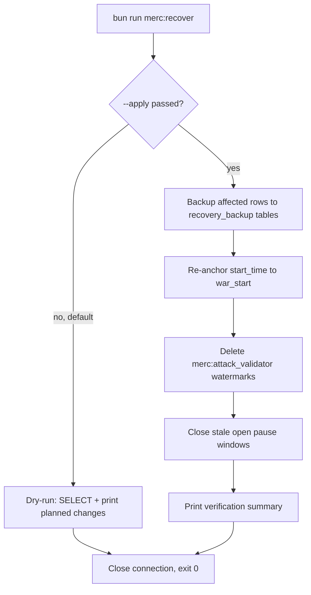

# Plan — Prod Recovery as a TypeScript Script

> **Status: implemented.** Delivered as
> [`scripts/merc-prod-recovery.ts`](../../scripts/merc-prod-recovery.ts) and wired up as
> `bun run merc:recover`. The earlier `.sql` file has been deleted. Typechecks clean and
> the dry-run path has been executed successfully against the dev database.

## Why the SQL file was wrong

The app services run as **systemd units on the host** (`.systemd/sentinel-*.service`,
`WorkingDirectory=/opt/sentinel-v2`, `ExecStart=bun run <service>:start`), not inside the
app container. Postgres runs as a **separate container**. So `psql` is not on the PATH where
the app runs, and `docker compose exec` from inside the app container is not available.

That makes [`scripts/merc-prod-recovery.sql`](../../scripts/merc-prod-recovery.sql) unusable
as written.

## The right approach

Your app already has a working programmatic DB connection:
[`createSqlClient()`](../../packages/database/index.ts:6) reads `DATABASE_URL` / `POSTGRES_*`
and returns a `postgres.js` client, re-exported as `sqlClient`. That is the **same client**
[`migrate.ts`](../../packages/database/src/scripts/migrate.ts:29) uses to run raw SQL outside
of Drizzle migrations.

So the repair should be a TypeScript script that imports `sqlClient` from
`@sentinel/database` and issues tagged-template SQL. It runs the same way as your other
scripts — `bun run <name>` — with no `psql` and no container juggling.

## Design



### Safety properties

- **Dry-run by default.** Without `--apply` the script only reads and prints what it *would*
  change. This is the important default — a repair script should never mutate on a bare run.
- **Explicit opt-in.** `--apply` is required for any write.
- **Uses the app's own client.** No new connection config, no credentials in the script.
- **Closes cleanly** via `closeDatabase()` so the process exits cleanly under systemd/bun.
- **Idempotent.** Re-running produces no further changes.
- **Scoped writes.** Only touches `merc_contracts` rows with `start_time < war_start`, and only
  deletes `system_states` rows matching `merc:attack_validator:%`. Never touches
  `merc_contract_hits`.

### What each step does

| Step | Purpose |
|---|---|
| Diagnose | List live/upcoming/paused contracts, back-dated start times, watermarks, hit counts |
| Backup | `CREATE TABLE ... AS SELECT` into `merc_contracts_recovery_backup` / `system_states_recovery_backup` (skipped if they already exist) |
| Re-anchor | `UPDATE merc_contracts SET start_time = war_start` where the row was back-dated by the minutes-before-war offset |
| Reset watermarks | `DELETE FROM system_states WHERE id LIKE 'merc:attack_validator:%'` so the validator back-fills |
| Close pause windows | For any contract stuck in `paused` with an open (`resumedAt: null`) window, set `status='active'` and stamp `resumedAt` |
| Verify | Re-run the diagnostics to confirm the post-state |

## Work items

- [x] Create [`scripts/merc-prod-recovery.ts`](../../scripts/merc-prod-recovery.ts) importing
      `sqlClient` + `closeDatabase`.
- [x] Implement `--apply` / dry-run gating with a clear banner either way.
- [x] Implement diagnose, backup, re-anchor, watermark reset, pause-window close, verify.
- [x] Add `"merc:recover": "bun run scripts/merc-prod-recovery.ts"` to
      [`package.json`](../../package.json) scripts.
- [x] Delete `scripts/merc-prod-recovery.sql` — wrong format, would mislead the next reader.
- [x] Update section E of
      [`merc-prod-incident-remediation.md`](merc-prod-incident-remediation.md).
- [x] Verify: typechecks clean, dry-run executes without writes.

### Implementation notes

- Imports use the relative path `"../packages/database"` rather than
  `"@sentinel/database"`, matching the convention in
  [`scripts/faction-ranked-war-hits.ts`](../../scripts/faction-ranked-war-hits.ts).
- `scripts/**` is **excluded** from the root `tsconfig.json`, so the repo-wide
  `bun typecheck` does not cover this file. It was verified with a temporary scoped
  tsconfig (`include: ["scripts/merc-prod-recovery.ts"]`), which was removed afterwards.

## Usage

```bash
# Preview — no writes (default)
ssh root@dejis-cloud
cd /opt/sentinel-v2 && bun run merc:recover

# Apply
cd /opt/sentinel-v2 && bun run merc:recover --apply
```

## Note on scope

This remains **optional**. The code fixes govern all future contracts. This only repairs rows
and watermarks left broken by the incident. Skipping it means the currently-affected contract
keeps its stale watermark and does not back-fill its missed hits.

Schema changes are **not** in this script — those are Drizzle migrations that run during deploy.